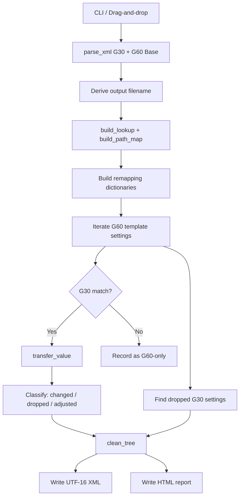

# G30 → G60 Conversion Process — Technical Reference

This document describes how `convert_g30_to_g60.py` converts GE Multilin UR **G30** relay settings XML into **G60** format. It walks through every stage of the pipeline, explains why each step is designed the way it is, and includes code excerpts from the script.

---

## Table of Contents

1. [Overview](#overview)
2. [Inputs and Outputs](#inputs-and-outputs)
3. [High-Level Pipeline](#high-level-pipeline)
4. [Entry Point](#entry-point)
5. [Phase 1 — Parse XML Files](#phase-1--parse-xml-files)
6. [Phase 2 — Derive Output Identity](#phase-2--derive-output-identity)
7. [Phase 3 — Build Lookup Tables](#phase-3--build-lookup-tables)
8. [Phase 4 — Build Remapping Dictionaries](#phase-4--build-remapping-dictionaries)
9. [Phase 5 — Match and Transfer Settings](#phase-5--match-and-transfer-settings)
10. [Phase 6 — Value Transfer by Setting Type](#phase-6--value-transfer-by-setting-type)
11. [Phase 7 — Classify Results](#phase-7--classify-results)
12. [Phase 8 — Sanitize and Write Output](#phase-8--sanitize-and-write-output)
13. [Phase 9 — HTML Conversion Report](#phase-9--html-conversion-report)
14. [Register Matching Key](#register-matching-key)
15. [What the Script Never Changes](#what-the-script-never-changes)
16. [Failure and Fallback Behavior](#failure-and-fallback-behavior)

---

## Overview

GE UR Setup exports relay configuration as XML. A G30 file and a G60 file share the same *logical* register layout, but they differ in:

- **Firmware version** and `orderCode`
- **Display names** for some settings (especially contacts and virtual outputs)
- **Internal operand codes** (`FlexValue`, user-display item codes)
- **Enum table indices** (`EnumFormatIndex`)
- **Decimal precision** expected by Number registers

The converter does **not** invent a G60 structure from scratch. It starts from a blank **`G60 Base.xml`** template (exported from the target firmware) and overlays G30 configuration values wherever registers match.

**Design principle:** The G60 template is the source of truth for structure, firmware identity, and G60-native codes. The G30 file is the source of truth for site-specific configuration intent.

---

## Inputs and Outputs

| Input | Purpose |
|-------|---------|
| G30 source XML | Site-specific configuration to convert |
| `bases/G60 Base.xml` | Blank G60 template from target firmware (default for CLI / Azure) |

| Output | Purpose |
|--------|---------|
| `<DeviceName>.xml` | Converted G60 settings, UTF-16 LE encoded, ready for UR Setup import |
| `<DeviceName>_OR.html` | Self-contained conversion report for review |

---

## High-Level Pipeline



---

## Entry Point

When run directly, the script accepts a G30 file path and an optional output directory:

```python
if __name__ == "__main__":
    here = Path(__file__).parent

    if len(sys.argv) < 2:
        print("Usage:  python convert_g30_to_g60.py  <g30_source.xml>  [output_dir]")
        sys.exit(0)

    g30_path  = Path(sys.argv[1])
    output_dir = Path(sys.argv[2]) if len(sys.argv) > 2 else here / "Converted"

    g60_template_path = select_base_template(g30_path, here)
    convert(g30_path, g60_template_path, output_dir)
```

**Why:** The G60 template path is fixed relative to the script so drag-and-drop usage (via `Convert G30 to G60.bat`) never requires the operator to specify it. Default output goes to `Converted/` to avoid overwriting inputs.

`select_base_template()` resolves `bases/G60 Base.xml` under the script directory and raises if missing — there is no auto-detection because the template must match the target relay firmware exactly.

---

## Phase 1 — Parse XML Files

```python
def parse_xml(path: Path) -> ET.Element:
    with open(path, "rb") as f:
        raw = f.read()

    try:
        return ET.fromstring(raw)
    except ET.ParseError:
        try:
            return ET.fromstring(raw.decode("utf-16-le"))
        except (UnicodeDecodeError, ET.ParseError):
            raise
```

**Why:** UR Setup exports vary in encoding. Newer files are often UTF-16 LE (with or without BOM); older exports may be UTF-8. Reading raw bytes and attempting UTF-8 first, then UTF-16 LE, handles both without requiring the operator to specify encoding.

The root element is a `<URDevice>` node with attributes such as:

```xml
<URDevice version="860"
          orderCode="G60-V00-HKL-F8L-H6P-M8L-P5A"
          deviceName="publix 1602 g60 test"
          URSetupVersion="8.71"
          ...>
```

Nested inside are `<Section>`, `<Screen>`, and `<Setting>` elements representing the UR Setup menu tree.

---

## Phase 2 — Derive Output Identity

### Device name for the output file

```python
def derive_output_device_name(g30_device_name: str, g60_order_code: str) -> str:
    g60_model = g60_order_code.split("-")[0].lower()
    first_word = g30_device_name.split(" ")[0] if " " in g30_device_name else g30_device_name
    underscore_idx = g30_device_name.find("_")
    suffix = g30_device_name[underscore_idx:] if underscore_idx != -1 else ""
    return f"{first_word} {g60_model}{suffix}"
```

**Example:**

| Component | Value |
|-----------|-------|
| G30 `deviceName` | `publix firmware7-6_208v4000a[86]` |
| G60 `orderCode` | `G60-V00-HKL-...` |
| Result | `publix g60_208v4000a[86]` |

**Why:** Site identity (prefix + voltage/amp suffix) lives in the G30 name, but the model identifier must come from the G60 `orderCode` — not from the template's `deviceName` — so the output name reflects the actual target hardware.

### UR Setup title-casing

```python
def ur_title_case(device_name: str) -> str:
    # 1. Capitalize first letter of each space-delimited token
    # 2. Capitalize letters immediately following digits (208v → 208V)
    ...
```

**Why:** UR Setup filenames use a specific capitalization convention (`Publix G60_208V4000A[86]`). Reproducing it makes converted files look native in file browsers and UR Setup project lists.

### What is preserved from the template

Inside `convert()`:

```python
g60_order_code = g60_root.get("orderCode", "")
output_device_name_raw = derive_output_device_name(g30_device_name_raw, g60_order_code)
output_device_name = ur_title_case(output_device_name_raw)

output_xml_path  = output_dir / f"{output_device_name}.xml"
output_html_path = output_dir / f"{output_device_name}_OR.html"
```

The output XML keeps the G60 template's `version` and `orderCode`. Only the filename (and the operator-visible device identity) is derived from the G30 source.

---

## Phase 3 — Build Lookup Tables

### Setting register lookup

Every `<Setting>` element is indexed by a five-part composite key:

```python
def build_lookup(root: ET.Element) -> dict:
    lookup = {}
    for setting in root.iter("Setting"):
        key = (
            setting.get("labelID", ""),
            setting.get("group", "0"),
            setting.get("module", "0"),
            setting.get("item", "0"),
            setting.get("bit", "0"),
        )
        if key not in lookup:
            lookup[key] = setting
    return lookup
```

**Why:** `labelID` alone is not unique. UR registers repeat the same label across breaker modules, display slots, FlexLogic rows, etc. The `(labelID, group, module, item, bit)` tuple is the firmware-level identity of a register and is stable across G30 and G60 exports of the same logical setting.

**Example key:**

```
(UR_DATA_USER_DISPLAY_X_DISPLAYED_ITEMS, 1, 2, 1, 0)
                                          ↑  ↑  ↑
                                       group module=item=1 (Item 1 slot)
                                              display 2
```

### Breadcrumb path map

```python
def build_path_map(root: ET.Element) -> dict:
    def walk(el, crumb):
        paths[id(el)] = crumb
        name = el.get("screenName", el.tag)
        child_crumb = f"{crumb} > {name}" if crumb else name
        for child in el:
            walk(child, child_crumb)
    ...
```

**Why:** Register keys are precise but not human-readable. The path map (`Settings > Product Setup > User-definable displays > ...`) is stored on each transfer record and rendered in the HTML report so reviewers can find settings in UR Setup.

---

## Phase 4 — Build Remapping Dictionaries

Before transferring values, the script builds several lookup structures from the XML trees.

### 4a. G60 Flex name → FlexValue map (from existing settings)

```python
g60_flex_fv_map: dict[str, str] = {}
for s in g60_root.iter("Setting"):
    if s.get("SettingType") == "Flex":
        op = s.get("value", "")
        fv = s.get("FlexValue", "")
        if op and fv and op not in g60_flex_fv_map:
            g60_flex_fv_map[op] = fv
```

**Why:** Flex settings store both a display string (`value`) and a firmware-internal code (`FlexValue`). UR Setup requires these to match as a pair. This map captures canonical G60 pairings already present in the template.

### 4b. G60 Flex operand table (EnumType 10012 + 10013)

```python
def build_flex_operand_map(root: ET.Element) -> dict[str, str]:
    """Map flex operand display names to G60 FlexValue codes."""
    # FormatIndex 10012 — logic, contacts, VOs, protection outputs
    # FormatIndex 10013 — measurement/signal sources (SRC1 Ia RMS, SRC1 P, ...)
```

Each `EnumType` element contains an `Items` attribute — a semicolon-delimited dictionary:

```
6912 SRC1       P;6944 SRC2       P;6976 SRC3       P;...
```

Parsed into `{name: code}`:

```python
def _parse_flex_operand_items(items: str, operand_map: dict[str, str]) -> None:
    for entry in items.split(";"):
        code, sep, name = entry.partition(" ")
        if name not in operand_map:
            operand_map[name] = code
```

**Why:** The blank G60 template rarely has configured Flex operands, so the template's `<Setting>` elements alone cannot supply all name→code mappings. The firmware operand tables embedded in the XML are the authoritative G60 codebook for LED assignments, oscillography sources, DCMA outputs, and similar Flex picks.

**Fallback detection:** If `FormatIndex` values differ between firmware versions, the script heuristically identifies tables by content (`Virt Op` / `Cont Ip` for logic, `SRC1` + `Ia RMS` for signals).

### 4c. Signal operand tables (for user-display Item remapping)

```python
_SIGNAL_OPERAND_TABLE_INDEX = "10013"
_G60_USER_DISPLAY_CODE_OFFSET = 262144  # 0x40000

def build_signal_operand_tables(root: ET.Element) -> tuple[dict[str, str], dict[str, str]]:
    """Return (code_to_name, name_to_code) from measurement/signal table 10013."""
```

Built separately from the Flex operand map because user-display Item settings need **bidirectional** lookup (code→name on G30, name→code on G60) and apply a different encoding on G60 than Flex settings do.

**Why the offset exists:**

| Platform | Setting | SRC1 P code |
|----------|---------|-------------|
| G30 user display Item | `Number` value | `7168` (= enum code) |
| G30 Flex setting | `FlexValue` | `7168` |
| G60 Flex setting | `FlexValue` | `6912` |
| G60 user display Item | `Number` value | `269056` (= `6912 + 262144`) |

G30 stores the raw signal enum code. G60 stores `enum_code + 0x40000` in user-display Item fields. A naïve numeric copy fails.

---

## Phase 5 — Match and Transfer Settings

The conversion loop iterates **every Setting in the G60 template** (not the G30 file):

```python
for setting in g60_root.iter("Setting"):
    key = (
        setting.get("labelID", ""),
        setting.get("group", "0"),
        setting.get("module", "0"),
        setting.get("item", "0"),
        setting.get("bit", "0"),
    )
    g30_match = g30_lookup.get(key)

    if g30_match is not None:
        rec = TransferredRecord(...)
        rec.adjustment_note = transfer_value(
            setting, g30_match,
            g60_flex_fv_map, g60_operand_map,
            g30_signal_code_to_name, g60_signal_name_to_code,
        )
        transferred_records.append(rec)
    else:
        g60_only_records.append(G60OnlyRecord(...))
```

**Why iterate G60, not G30:**

- The G60 template defines the complete output structure. G60-only registers must appear in the output at their template defaults.
- G30 settings with no G60 equivalent are detected afterward by comparing key sets and recorded as **dropped**.

### Dropped G30 settings

```python
g60_keys = { ... for s in g60_root.iter("Setting") }
for key, el in g30_lookup.items():
    if key not in g60_keys:
        dropped_records.append(DroppedRecord(...))
```

**Why:** Some G30 features have no register in G60 firmware. These cannot be carried forward; the report flags them so the operator knows configuration was lost.

---

## Phase 6 — Value Transfer by Setting Type

All value logic is centralized in `transfer_value()`:

```python
def transfer_value(g60_el, g30_el, g60_flex_fv_map, g60_operand_map,
                   g30_signal_code_to_name, g60_signal_name_to_code):
    stype = g60_el.get("SettingType", "")
    raw_g30_value = g30_el.get("value", g60_el.get("value", ""))
    ...
```

Each `SettingType` follows different rules.

### 6a. Text and other simple types

```python
else:
    g60_el.set("value", clean_value(raw_g30_value))
```

**Why:** Text settings (user-display Top Line, Bottom Line, labels, etc.) are literal strings with no firmware code translation.

### 6b. Number settings

```python
if stype == "Number":
    adjusted_value, adjustment_note = maybe_adjust_legacy_number_value(g60_el, raw_g30_value)
    if adjusted_value is not None:
        raw_g30_value = adjusted_value
    g60_el.set("value", clean_value(reformat_number_value(raw_g30_value, g60_template_value)))
```

#### Decimal precision reformatting

```python
def reformat_number_value(g30_value: str, g60_template_value: str) -> str:
    """Keep G30 numeric quantity; match G60 decimal places."""
    # G30: "1.00 Hz"  +  G60 template: "1.000 Hz"  →  "1.000 Hz"
```

**Why:** UR Setup rejects Number values whose decimal format doesn't match the register's expected precision, even when the numeric quantity is correct.

#### Legacy special case

```python
def maybe_adjust_legacy_number_value(g60_el, g30_value):
    if g60_el.get("labelID") == "UR_DATA_IEC_POWER_FACTOR_DEFAULT_THRESHOLD":
        return g60_el.get("value", ""), "Preserved G60 template default"
```

**Why:** This register behaves differently across firmware generations; preserving the G60 default avoids import errors.

#### User-display Item remapping (targeted exception)

Before the generic Number path, displayed items are handled specially:

```python
if (stype == "Number"
        and g60_el.get("labelID") == _USER_DISPLAY_ITEMS_LABEL
        and g30_signal_code_to_name is not None
        and g60_signal_name_to_code is not None):
    remapped, adjustment_note = remap_user_display_item(
        raw_g30_value, g30_signal_code_to_name, g60_signal_name_to_code,
    )
    if remapped is not None:
        g60_el.set("value", clean_value(remapped))
    return adjustment_note
```

```python
def remap_user_display_item(g30_value, g30_code_to_name, g60_name_to_code):
    if not g30_value or g30_value == "0":
        return "0", None

    signal_name = g30_code_to_name.get(g30_value)          # 7168 → "SRC1       P"
    g60_code = g60_name_to_code.get(signal_name)           # "SRC1       P" → 6912
    g60_display = str(int(g60_code) + _G60_USER_DISPLAY_CODE_OFFSET)  # → 269056
    return g60_display, f"User display item: {signal_name.strip()} ({g30_value} -> {g60_display})"
```

**Why name-based lookup instead of a fixed offset:**

A fixed numeric offset (e.g. `+261888`) works for some signals by coincidence, but G30 and G60 enum codes for the same signal name can differ by varying amounts. Resolving through the signal **name** in table 10013 is the only reliable approach.

**Fallback:** If the G30 code is unknown or the signal doesn't exist on the target G60 hardware, the template default (`0`) is kept and an adjustment note is recorded — same philosophy as unavailable Flex operands.

### 6c. Enum settings

```python
elif stype == "Enum":
    g60_el.set("value", clean_value(raw_g30_value))
    if "EnumValue" in g30_el.attrib:
        g60_el.set("EnumValue", clean_value(g30_el.get("EnumValue", "")))
```

**Why:** The display text (`value`) and selection index (`EnumValue`) are transferred from G30. The G60 `EnumFormatIndex` is **not** changed — it always stays from the template, because G30 and G60 use different enum tables even when the display text matches.

### 6d. Flex settings (most complex path)

Flex settings require remapping both `value` (display name) and `FlexValue` (firmware code):

```python
elif stype == "Flex":
    remapped = remap_g30_flex_operand(
        raw_g30_value, g30_fv_raw,
        g60_operand_map or {}, g60_flex_fv_map,
    )
    if remapped is not None:
        g60_value, g60_fv = remapped
        g60_el.set("value", clean_value(g60_value))
        g60_el.set("FlexValue", clean_value(g60_fv))
    else:
        # Unresolvable → keep G60 template default
        pass
```

`remap_g30_flex_operand()` handles several operand categories:

#### Direct name match

```python
if operand_map and operand in operand_map:
    return operand, operand_map[operand]
```

If the G30 operand string exists verbatim in the G60 operand table, use its G60 code.

#### OFF / zero

```python
if operand in ("OFF", "Off") or g30_fv == 0:
    return off_value, operand_map.get("OFF", "0")
```

#### Assign-virtual-output (`= Parallel (VO1)`)

```python
if operand.startswith("= "):
    vo_match = _ASSIGN_VO_SUFFIX.search(operand)
    if vo_match:
        return operand, str(_G60_ASSIGN_VO_BASE + int(vo_match.group(1)))
```

**Why:** Assign-VO labels are user-defined and should be preserved. Only the firmware code shifts from G30 base (`12800 + n`) to G60 base (`3276800 + n`).

#### Hardware-address operands (contacts, VOs)

```python
def resolve_g60_flex_operand(operand, operand_map):
    # Match by address suffix: "Gen Aux On(H8a)" → "Cont Ip 3 On(H8a)"
    hw_match = _HW_ADDR_SUFFIX.search(operand)  # extracts "H8a"
    # Filter candidates by On/Off state
    ...
```

**Why:** G30 exports often use custom contact labels. The hardware address `(H8a)` is stable; the display name is not. Matching by address suffix finds the canonical G60 operand name and code.

#### FlexLogic syntax tokens (`AND(3)`, `TIMER 2`, `NOT`, etc.)

FlexLogic gate/timer operands (`AND(n)`, `OR(n)`, `NAND(n)`, `NOR(n)`, `TIMER n`, `NOT`, `XOR`, `END`) store a firmware-internal `FlexValue` that encodes both an **opcode** and an **input count** (or timer index). G60 expects the wide form: `(opcode << 16) | count`.

G30 source files arrive in one of two encodings:

| Style | Typical source | `AND(2)` FlexValue | Opcode layout |
|-------|----------------|-------------------|---------------|
| **Legacy packed** | Older G30 exports (e.g. Leesburg) | `10754` (`0x2A02`) | `(opcode << 8) \| count` — fits in 16 bits |
| **Wide** | Newer G30 exports and native G60 (e.g. HCHPublix, Publix 1367) | `2752514` (`0x2A0002`) | `(opcode << 16) \| count` — already G60-compatible |

```python
def _flexlogic_syntax_code(g30_fv: int) -> int:
    # Wide values are already G60-compatible; shifting again corrupts the code.
    if g30_fv > 0xFFFF:
        return g30_fv
    return ((g30_fv >> 8) << 16) | (g30_fv & 0xFF)
```

**Examples:**

| Token | Legacy packed (G30) | After conversion | Wide (G30) | After conversion |
|-------|--------------------:|-----------------:|-----------:|-----------------:|
| `AND(2)` | `10754` | `2752514` | `2752514` | `2752514` (unchanged) |
| `NOT` | `8704` | `2228224` | `2228224` | `2228224` (unchanged) |
| `OR(2)` | `10242` | `2621442` | `2621442` | `2621442` (unchanged) |
| `END` | `8192` | `2097152` | `2097152` | `2097152` (unchanged) |

**Why two formats exist:** UR Setup began exporting FlexLogic syntax codes in the wide G60 form in newer G30 firmware exports. Legacy files still use the 16-bit packed form. The `> 0xFFFF` guard distinguishes them without needing firmware version metadata.

**Failure mode (fixed 2026-07-06):** Applying the shift unconditionally to wide-format G30 files double-encoded the opcode (e.g. `AND(2)` `2752514` → `704643074`). UR Setup rejected those `UR_DATA_FLEXLOGIC_ENTRY` rows ("Error reading value… FLEXLOGIC ENTRY"), reset them to `Off`, and downstream operands then reported "Output of the token … is not connected" — even when the contact operand itself (`Gen Aux On(H8a)`) was correct.

**Note:** `END` is often resolved earlier via the G60 operand table (same numeric code on both devices) and never reaches `_flexlogic_syntax_code()`. Gate and timer tokens typically do.

#### Unresolvable operands

```python
else:
    # G30 operand unknown in this G60 config; keep template default
    pass  # g60_el retains its template value and FlexValue unchanged
```

**Why:** If G30 references a signal the G60 hardware doesn't have (e.g. `SRC4 Ia RMS` when Source 4 isn't in the order code), writing a wrong code causes import errors. Keeping the template default is safer than guessing.

---

## Phase 7 — Classify Results

After the transfer loop, records are sorted into review categories:

```python
value_changes   = [r for r in transferred_records if r.value_changed]
name_diffs      = [r for r in transferred_records if r.name_changed]
range_warnings  = [r for r in transferred_records if r.range_warning]
auto_adjusted   = [r for r in transferred_records if r.adjustment_note]
unchanged       = [r for r in transferred_records if not r.value_changed]
```

### Range checking

```python
def check_range(setting, g30_value_str):
    val = parse_number_value(g30_value_str)
    lo, hi = setting.get("MinValue"), setting.get("MaxValue")
    if val < float(lo): return f"{val} < G60 min {lo}"
    if val > float(hi): return f"{val} > G60 max {hi}"
```

**Why:** G60 registers can have tighter bounds than G30. Values are still written (the operator may need them), but the HTML report flags out-of-range entries for manual review.

A console summary is printed:

```
  Total G30 settings              : 4821
  Transferred G30 -> G60          : 4750
    of which values changed       : 892
    of which were auto-adjusted   : 14
  G60-only (kept at defaults)     : 312
  G30-only (dropped)              : 71
```

---

## Phase 8 — Sanitize and Write Output

### Control character cleanup

```python
def clean_tree(root):
    for el in root.iter():
        if el.text:   el.text = clean_value(el.text)
        if el.tail:   el.tail = clean_value(el.tail)
        for attr, value in list(el.attrib.items()):
            el.set(attr, clean_value(value))
```

**Why:** Legacy G30 exports sometimes contain control characters invalid in XML. UR Setup rejects the file if these survive.

### Overwrite protection

```python
input_paths = {g30_path.resolve(), g60_template_path.resolve()}
for out in (output_xml_path, output_html_path):
    if out.resolve() in input_paths:
        sys.exit(1)
```

**Why:** Prevents accidental destruction of the G30 source or G60 template when the output directory is misconfigured.

### XML output encoding

```python
ET.indent(g60_root, space="\t")
xml_out = '<?xml version="1.0" ?>\n' + ET.tostring(g60_root, encoding="unicode") + "\n"
with open(output_xml_path, "wb") as f:
    f.write(xml_out.encode("utf-16-le"))
```

**Why:** UR Setup expects UTF-16 LE for settings import on Windows. The XML declaration says `1.0` without an encoding attribute, which matches UR Setup's own export format.

---

## Phase 9 — HTML Conversion Report

`build_html_report()` generates a self-contained HTML file with embedded CSS and JavaScript. No external dependencies.

### Report sections

| Section | Contents |
|---------|----------|
| **Range Warnings** | Number values outside G60 Min/Max |
| **Automatic Adjustments** | Values modified by special rules (user-display remap, IEC threshold, etc.) |
| **Value Changes** | Every setting where the applied value differs from the G60 template default |
| **Setting Name Differences** | Same register key, different display name between G30 and G60 |
| **G60-Only Settings** | Registers in G60 with no G30 source — kept at defaults |
| **Dropped G30 Settings** | G30 registers with no G60 equivalent — values lost |
| **Transferred Unchanged** | Identical values (collapsed by default) |

Each table row includes:

- Breadcrumb path in the G60 menu tree
- Setting name
- Register key `(labelID, group, module, item, bit)`
- Setting type badge (`Number`, `Enum`, `Flex`)
- Before/after values

Tables support live text filtering via a search box.

**Why a report file:** Conversion is lossy in places (dropped settings, unavailable operands, auto-adjusted codes). The report gives the operator a complete audit trail without requiring UR Setup's Device Comparison tool.

---

## Register Matching Key

The fundamental identity of every setting:

```
(labelID, group, module, item, bit)
```

| Field | Meaning | Example |
|-------|---------|---------|
| `labelID` | Firmware register identifier | `UR_DATA_USER_DISPLAY_X_DISPLAYED_ITEMS` |
| `group` | Setting group index | `1` |
| `module` | Module/slot index (breaker #, display #, VO #) | `2` (= User Display 2) |
| `item` | Sub-item within module | `1` (= Item 1 slot) |
| `bit` | Bit index for packed registers | `0` |

Two settings with the same `labelID` but different `module` values are distinct registers. This is why matching by name or by `labelID` alone would fail.

---

## What the Script Never Changes

These attributes always come from the G60 template:

| Attribute | Reason |
|-----------|--------|
| `version` | Must match target relay firmware |
| `orderCode` | Defines hardware configuration |
| `EnumFormatIndex` | Points to G60-specific enum tables |
| `MinValue`, `MaxValue`, `Unit` | G60 register constraints |
| XML tree structure | Sections/screens not in G60 don't appear |

---

## Failure and Fallback Behavior

| Condition | Behavior |
|-----------|----------|
| G30 setting has no G60 register | Recorded as **dropped**; value not written |
| G60 setting has no G30 source | **G60-only**; template default kept |
| Flex operand unresolvable on G60 | Template default kept; not written |
| FlexLogic syntax code double-shifted on wide-format G30 export | UR Setup rejects `UR_DATA_FLEXLOGIC_ENTRY` rows; cascading "token … is not connected" errors. Fixed by `_flexlogic_syntax_code()` pass-through for values `> 0xFFFF` |
| User-display signal unknown or unavailable | Template default (`0`) kept; note in report |
| Number value out of G60 range | Value written; **range warning** in report |
| Output path would overwrite input | Script exits with error |
| `bases/G60 Base.xml` missing | Script exits with error |
| Signal operand table (10013) missing | User-display remapping skipped; warning printed |

**Target after import:** Zero **Invalid Settings** in UR Setup. Invalid entries indicate a value/format/code problem requiring investigation. **Differences** in Device Comparison are expected for intentional configuration changes, name differences, and G60-only features.

---

## Data Structures

The script uses dataclasses to accumulate audit records during conversion:

```python
@dataclass
class TransferredRecord:
    path: str
    label_id: str
    group: str
    module: str
    item: str
    bit: str
    g60_name: str
    g30_name: str
    setting_type: str
    g30_value: str              # value AFTER transfer (what was written)
    g60_template_value: str     # value BEFORE transfer (template default)
    range_warning: Optional[str]
    original_g30_value: Optional[str]
    adjustment_note: Optional[str]
```

```python
@dataclass
class DroppedRecord: ...     # G30 setting with no G60 register
@dataclass
class G60OnlyRecord: ...     # G60 setting with no G30 source
```

**Why dataclasses:** The conversion produces thousands of settings. Structured records let the same data drive both the console summary and the HTML report without re-parsing the XML tree.

---

## Quick Reference — SettingType Transfer Rules

| SettingType | Transferred from G30 | Kept from G60 template | Special handling |
|-------------|---------------------|------------------------|------------------|
| **Text** | `value` | — | Direct copy |
| **Number** | numeric quantity | `MinValue`, `MaxValue`, `Unit` | Decimal reformat; IEC threshold preserved; user-display Items remapped via signal table |
| **Enum** | `value`, `EnumValue` | `EnumFormatIndex` | Display text + index copied; enum table stays G60 |
| **Flex** | remapped `value` + `FlexValue` | default when unresolvable | Operand table lookup; VO assign base shift; FlexLogic opcode remap (packed → wide, wide pass-through); hardware-address matching |

---

## Related Files

| File | Role |
|------|------|
| `convert_g30_to_g60.py` | Main converter (source of truth) |
| `bases/G60 Base*.xml` | G60 templates — must match target firmware |
| `Convert G30 to G60.bat` | Windows drag-and-drop launcher |
| `azure/function_app/convert_g30_to_g60.py` | Copy deployed to Azure Function (sync via `azure/sync-from-root.ps1`) |
| `README.md` | Operator quick-start guide |

---

*Generated from `convert_g30_to_g60.py` as of the FlexLogic dual-format syntax-code fix (2026-07-06).*
